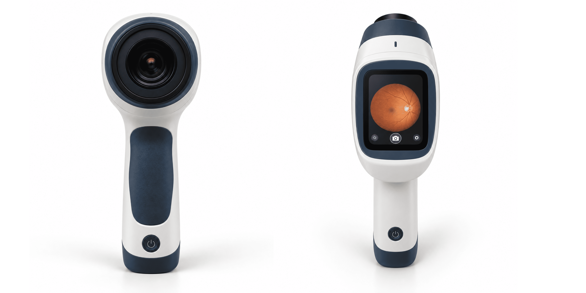
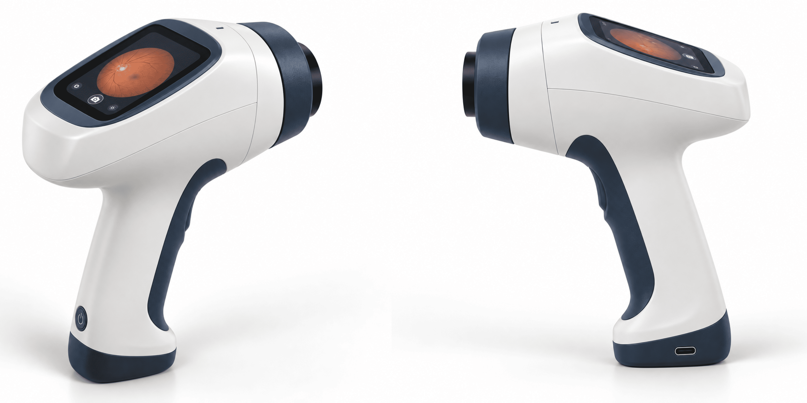
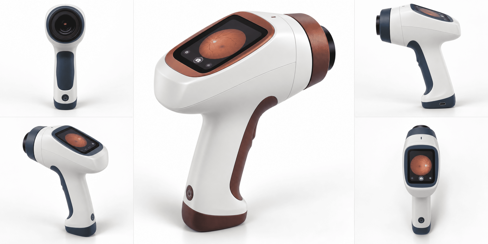

<div align="center">



# Eye Disease Detection using Deep Learning

Classification of retinal fundus images into four categories (cataract, diabetic retinopathy, glaucoma, normal) using a fine-tuned ResNet34.


</div>

---

## Overview

Cataract, glaucoma and diabetic retinopathy are major causes of preventable vision loss, and screening typically relies on specialists reviewing retinal photographs. This project trains a convolutional neural network on labelled fundus images to predict the most likely condition and return a probability for each class. A Gradio app (`app.py`) is included for interactive inference.

> **Disclaimer:** This is a research and learning project, not a medical device. Its output must not be used for diagnosis or treatment decisions.

## Dataset

The model is trained on the [Eye Diseases Classification](https://www.kaggle.com/datasets/gunavenkatdoddi/eye-diseases-classification) dataset from Kaggle: 4,217 labelled retinal images in one folder per class, with no corrupt files found. It is also included in this repository as `dataset/` and `dataset.zip`. Refer to the Kaggle page for the dataset's licence and provenance.

<div align="center">

| Class | Description | Images |
|---|---|:---:|
| `cataract` | Clouding of the eye lens | 1,038 |
| `diabetic_retinopathy` | Retinal damage caused by diabetes | 1,098 |
| `glaucoma` | Optic nerve damage | 1,007 |
| `normal` | No disease | 1,074 |


<br><sub>Random sample of labelled images. Image quality, field of view and colour vary considerably. The classes are well balanced, so no re-weighting was applied.</sub>


</div>


## Method

The complete pipeline is in [`eye-desease.ipynb`](eye-desease.ipynb) (written for Kaggle with a GPU).

<div align="center">

| Component | Setting |
|---|---|
| Pre-processing | Images resized to a max side of 460 px on a copy of the dataset |
| Split | Stratified 70 / 15 / 15: **2,951 train, 633 validation, 633 test** (seed 42) |
| Test set | Separated before any training and never used for tuning or model selection |
| Input | `RandomResizedCrop` to 224 x 224 (min scale 0.75) |
| Augmentation | Rotation up to 15°, zoom up to 1.1, lighting 0.2, warp 0.1 |
| Architecture | ResNet34, ImageNet-pretrained (`vision_learner`) |
| Learning rate | `lr_find` valley, 1.4e-3 |
| Training | `fine_tune(15)` with early stopping (patience 3 on validation loss) and best-checkpoint saving |
| Batch size | 32 |
| Metrics | Accuracy, error rate, macro precision / recall / F1 |

</div>

Training stopped early after 14 unfrozen epochs. The best checkpoint (epoch 10, lowest validation loss) was restored and exported as `eye_disease_model.pkl`.

## Results

All headline numbers below are measured on the **held-out test set** (633 images).

**Overall: 91.6% accuracy (580 of 633 correct), macro F1 0.92.**

<div align="center">

| Class | Precision | Recall | F1 | Support |
|---|:---:|:---:|:---:|:---:|
| cataract | 0.97 | 0.92 | 0.94 | 156 |
| diabetic_retinopathy | 0.97 | 0.99 | 0.98 | 165 |
| glaucoma | 0.85 | 0.87 | 0.86 | 151 |
| normal | 0.88 | 0.89 | 0.88 | 161 |
| **Macro average** | **0.92** | **0.92** | **0.92** | 633 |

</div>

**Confusion matrix** (rows are the true class, columns the predicted class):

<div align="center">

| True \ Predicted | cataract | diabetic_retinopathy | glaucoma | normal |
|---|:---:|:---:|:---:|:---:|
| **cataract** | 143 | 0 | 8 | 5 |
| **diabetic_retinopathy** | 0 | 163 | 2 | 0 |
| **glaucoma** | 4 | 1 | 131 | 15 |
| **normal** | 1 | 4 | 13 | 143 |

</div>

- Diabetic retinopathy is the easiest class to identify (F1 0.98).
- Glaucoma is the hardest (F1 0.86). Most errors are between glaucoma and normal: 15 glaucoma images were predicted as normal and 13 normal images as glaucoma.
- 8 cataract images were predicted as glaucoma.

**Validation and training.** At the selected checkpoint the validation set (633 images) gave 94.8% accuracy and macro F1 0.947. This set was used for early stopping and checkpoint selection, so it is optimistic; the test-set figures above are the reference.

<details>
<summary>Training log (unfrozen epochs)</summary>

<br>

One frozen epoch (classifier head only) preceded these, ending at 80.9% validation accuracy. The best epoch is in bold.

| Epoch | Train loss | Valid loss | Accuracy | Macro F1 |
|:---:|:---:|:---:|:---:|:---:|
| 0 | 0.7880 | 0.4249 | 0.8310 | 0.8303 |
| 1 | 0.6459 | 0.3310 | 0.8705 | 0.8704 |
| 2 | 0.5667 | 0.3427 | 0.8768 | 0.8718 |
| 3 | 0.4757 | 0.2635 | 0.9084 | 0.9061 |
| 4 | 0.4013 | 0.3444 | 0.8910 | 0.8903 |
| 5 | 0.3668 | 0.2410 | 0.9115 | 0.9113 |
| 6 | 0.3186 | 0.2287 | 0.9194 | 0.9187 |
| 7 | 0.2428 | 0.2120 | 0.9163 | 0.9152 |
| 8 | 0.2117 | 0.2281 | 0.9242 | 0.9234 |
| 9 | 0.1877 | 0.2543 | 0.9273 | 0.9267 |
| **10** | **0.1472** | **0.2058** | **0.9479** | **0.9472** |
| 11 | 0.1142 | 0.2487 | 0.9352 | 0.9333 |
| 12 | 0.1032 | 0.2226 | 0.9415 | 0.9406 |
| 13 | 0.0843 | 0.2168 | 0.9400 | 0.9388 |

</details>

## Usage

**Install**

```bash
git clone https://github.com/aliiakbarkhan/Eye-Disease-Detection-DL.git
cd Eye-Disease-Detection-DL
pip install -r requirements.txt
```

**Run the Gradio app**

```bash
python app.py
```

**Predict from Python**

```python
from fastai.vision.all import *

learn = load_learner("eye_disease_model.pkl")
pred, idx, probs = learn.predict("path/to/retinal_image.jpg")

for label, p in zip(learn.dls.vocab, probs):
    print(f"{label}: {p:.4f}")
```

**Retrain**: the notebook reads the dataset from `/kaggle/input` and writes to `/kaggle/working`, so it runs directly on Kaggle with a GPU and the dataset attached. To run it locally, change the `SRC`, `WORK` and `TEST_DIR` paths. It also writes `model_card.json` with the split sizes and test metrics.

## Portable Screening Concept

The project is motivated by point-of-care screening: a handheld fundus camera that captures the retina and runs a classifier on the device. The renders below are concept illustrations only, not an existing product.

<div align="center">

<br><br>

</div>

## Limitations

- Not clinically validated; performance on other cameras, hospitals or populations is unknown.
- Evaluated on one random split of a single public dataset, with no external test set. On 633 test images the 95% confidence interval on accuracy is roughly ±2 percentage points.
- The split is per image, not per patient. If the dataset contains several images of the same patient, some leakage between splits is possible and the test score could be optimistic.
- Glaucoma and normal are frequently confused, which matters for screening because a missed disease is costlier than a false alarm.
- Supports only the four listed classes and will always return one of them, even for non-retinal images.

## Repository Structure

```text
Eye-Disease-Detection-DL/
├── images/                  # README images
├── dataset/                 # Labelled retinal images (one folder per class)
├── dataset.zip
├── eye-desease.ipynb        # Training and evaluation notebook
├── app.py                   # Gradio inference app
├── eye_disease_model.pkl    # Exported fastai model (ResNet34)
├── model_card.json          # Split sizes and test-set metrics
├── requirements.txt
├── output.png
└── README.md
```

## Author

**Ali Akbar Khan** — [GitHub](https://github.com/aliiakbarkhan)
